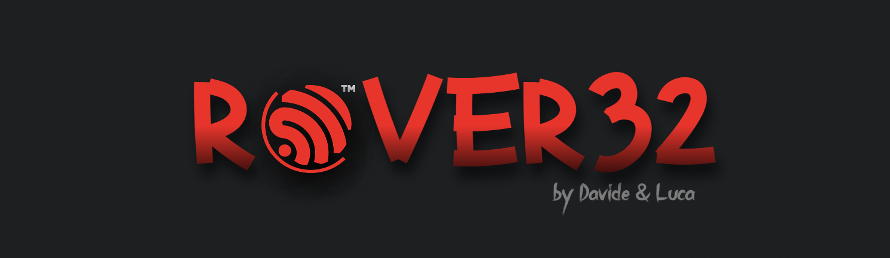
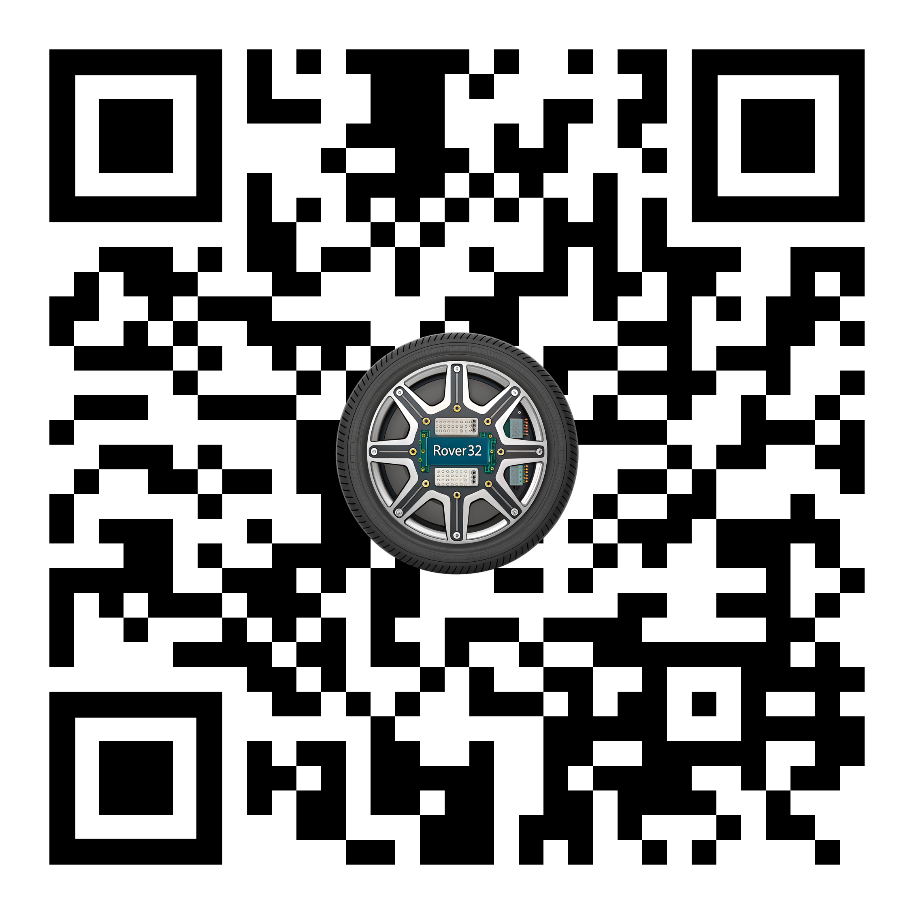

<p align="center">
  
</p>

<h1 align="center">ROVER32</h1>

<p align="center"><i>Empowering seamless control for your robotic adventures.</i></p>

<p align="center">
  <!-- Ultimo commit -->
  
  
  <!-- Linguaggio principale -->
  

  <!-- Conteggio linguaggi -->
  

  <!-- Dimensione repo -->
  

  <!-- Stars -->
  

  <!-- Forks -->
  

  <!-- Issues aperti -->
  

  <!-- Licenza -->
  
</p>

<p align="center"><i>Built with the tools and technologies:</i></p>

<p align="center">
  
  
  
  
  
  
  
  
  
  
  
  
  
  
  
  
  
  
  
  
  
  
  
</p>

## Overview

Rover32 is a versatile ESP32-based robotic platform that combines real-time video streaming, remote control capabilities, and a web interface for management and analytics. It's designed for educational and experimental purposes, providing a flexible architecture for building autonomous robots and remote-controlled vehicles.

## Key Features

- **Real-time Video Streaming**: Live camera feed via WebSocket connection
- **Remote Control**: Control movement, steering, and special functions wirelessly
- **Cross-platform Client**: Flutter desktop application for Windows, macOS, and Linux
- **Web Administration**: Analytics dashboard and vehicle management
- **OLED Display**: Status information and animations on the rover
- **Customizable Lighting**: Headlights, taillights, and status indicators

## Hardware Components

- **ESP32 Microcontroller**: Core processing unit with Wi-Fi and Bluetooth connectivity
- **Camera Module**: OV2640 camera for video streaming
- **Motors & L298N Driver**: Dual H-bridge motor controller for precise movement
- **SSD1306 OLED Display**: 128x32 monochrome display for status information
- **LED Lighting System**: Programmable status and navigation lights

## Software Architecture

The Rover32 system consists of multiple integrated components:

### ESP32 Firmware

- Written in C++ using PlatformIO/Arduino framework
- Manages camera capture, motor control, and TCP communication
- Handles WebSocket connections for both control and camera streaming
- OLED display management for status information

### TCP Protocol

- Raw TCP sockets for direct communication with minimal overhead
- Camera streaming (port 8000) and control commands (port 8001)
- Binary protocol with JPEG frames for video

### Flutter Desktop Application

- Cross-platform desktop application written in Flutter/Dart
- Provides control interface with keyboard/virtual joystick support
- Displays camera feed in real-time
- Manages connection to the rover

### Web Dashboard

- Built with Next.js, React, and TypeScript
- User authentication and vehicle management
- Statistics gathering and visualization
- API for integration with other services

## Documentation

Scan this QR code to access the complete documentation:

<p align="center">
  
</p>


Or visit the [online documentation](https://github.com/callmenoway/rover32) for:

- Setup guides
- API references
- Hardware schematics
- Troubleshooting information

## Technology Stack

### Backend
- **Next.js API Routes**: Server-side functionality and API endpoints
- **tRPC**: End-to-end typesafe API framework
- **Zod**: Schema validation for runtime type checking

### Frontend
- **React**: Component-based UI library
- **TypeScript**: Static type-checking for JavaScript
- **Tailwind CSS**: Utility-first CSS framework
- **shadcn/ui**: Reusable, accessible UI components
- **Radix UI**: Unstyled, accessible UI primitives
- **Lucide React**: SVG icon library

### Database & ORM
- **Prisma**: Modern ORM for database access
- **Supabase**: PostgreSQL-based database with integrated authentication

## Setup Instructions

1. **Clone the Repository**:
   ```bash
   git clone https://github.com/callmenoway/rover32.git
   cd rover32
