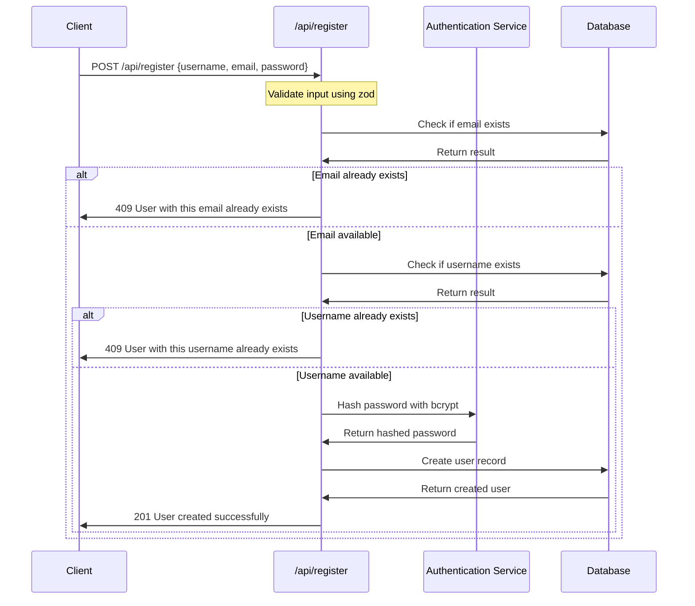
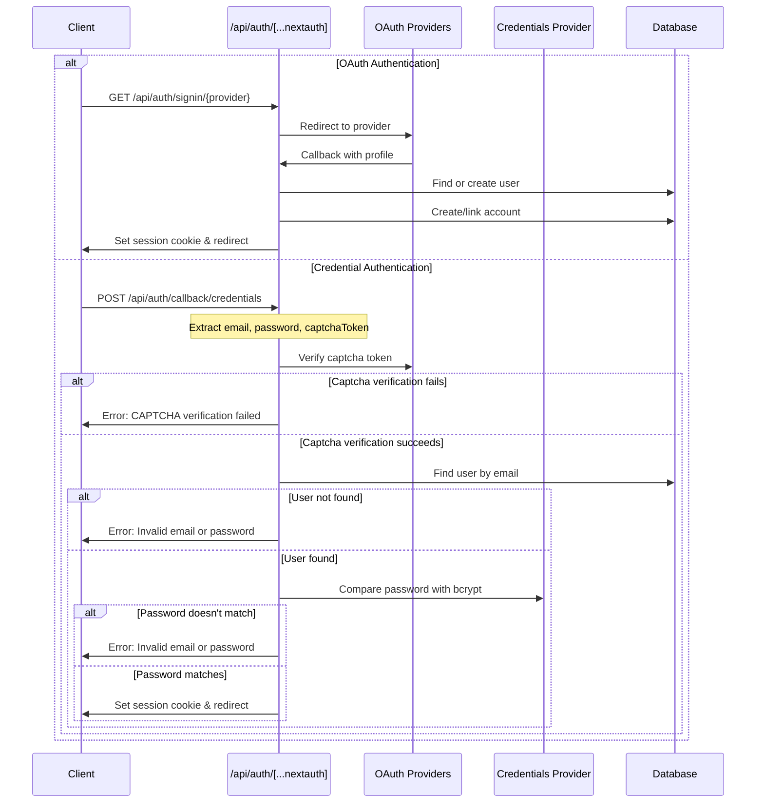
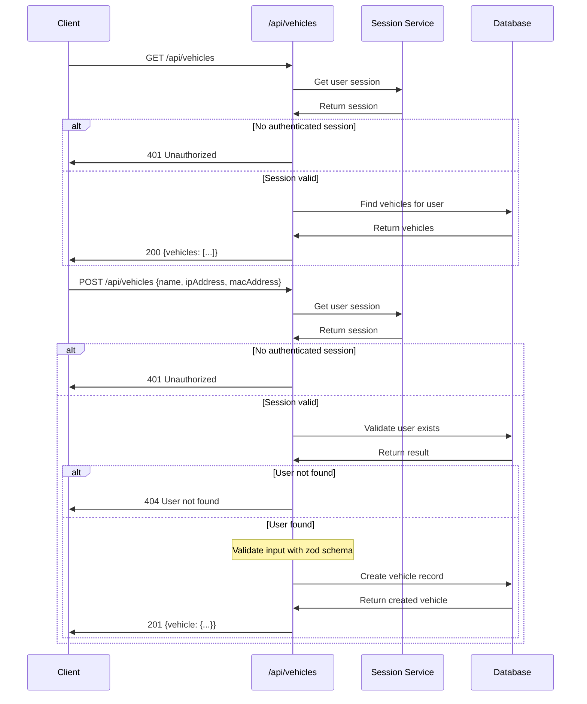
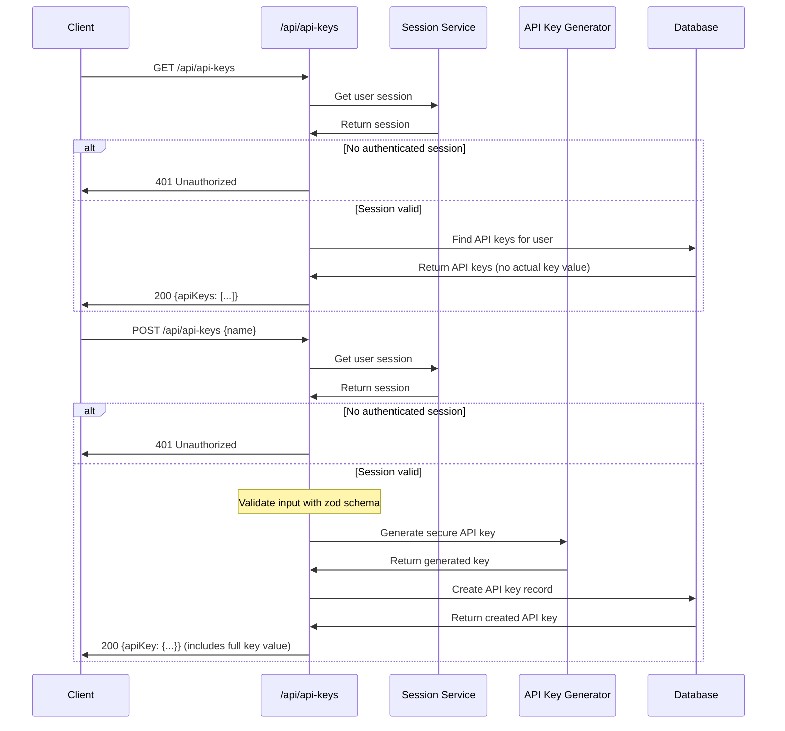
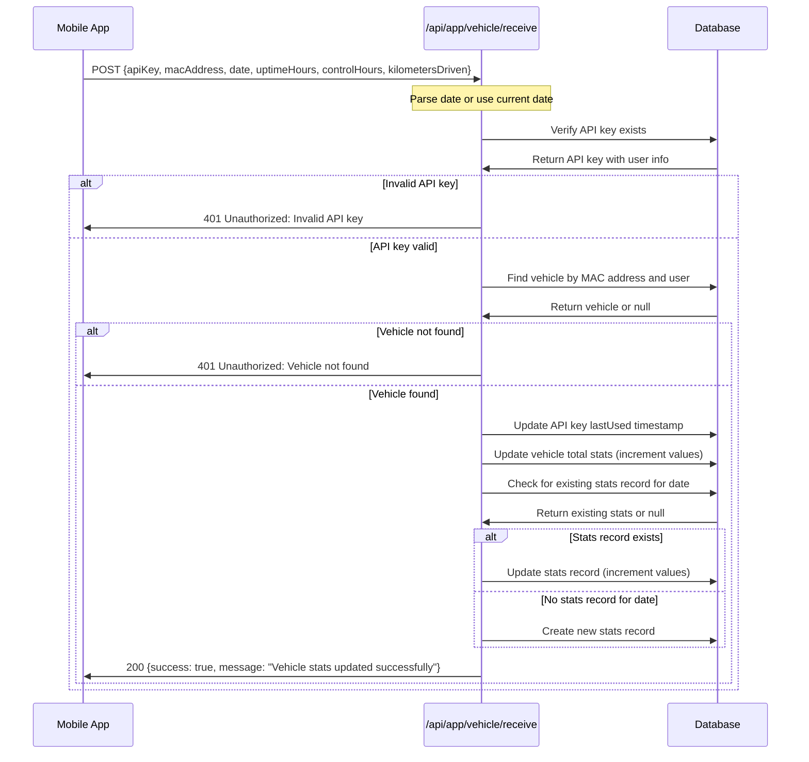
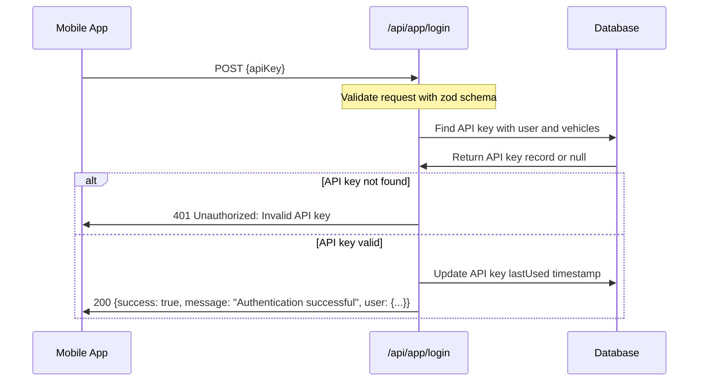
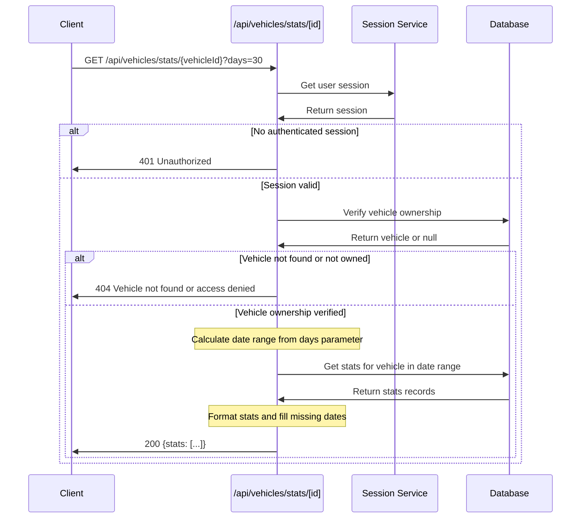

# Rover32 API Sequence Diagrams

This document contains UML sequence diagrams for the key API flows in the Rover32 system.

## 1. User Registration Flow

## 2. User Authentication Flow (NextAuth)

## 3. Vehicle Management Flow

## 4. API Key Management Flow

## 5. Vehicle Statistics Collection Flow

## 6. Mobile App Authentication Flow

## 7. Vehicle Statistics Retrieval Flow

